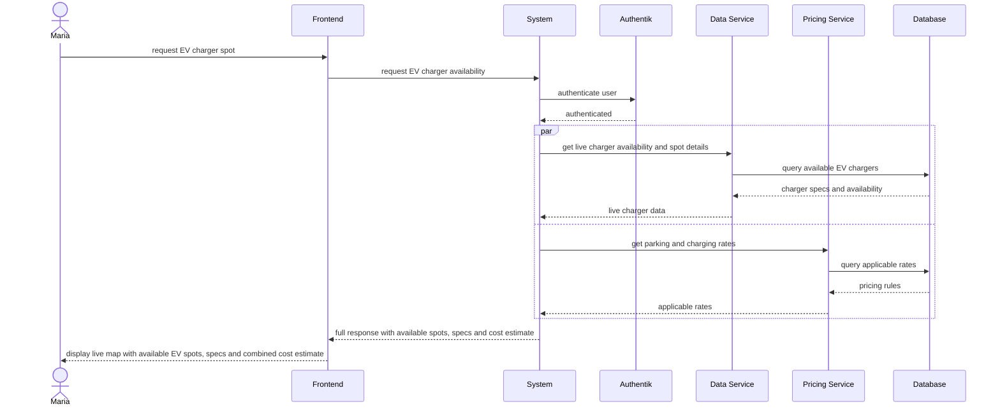

```mermaid
sequenceDiagram
    actor Maria
    participant FE as Frontend
    participant API as System
    participant Auth as Authentik
    participant Data as Data Service
    participant Pricing as Pricing Service
    participant DB as Database

    Maria->>FE: request EV charger spot
    FE->>API: request EV charger availability

    API->>Auth: authenticate user
    Auth-->>API: authenticated

    par
        API->>Data: get live charger availability and spot details
        Data->>DB: query available EV chargers
        DB-->>Data: charger specs and availability
        Data-->>API: live charger data
    and
        API->>Pricing: get parking and charging rates
        Pricing->>DB: query applicable rates
        DB-->>Pricing: pricing rules
        Pricing-->>API: applicable rates
    end

    API-->>FE: full response with available spots, specs and cost estimate
    FE-->>Maria: display live map with available EV spots, specs and combined cost estimate
```
